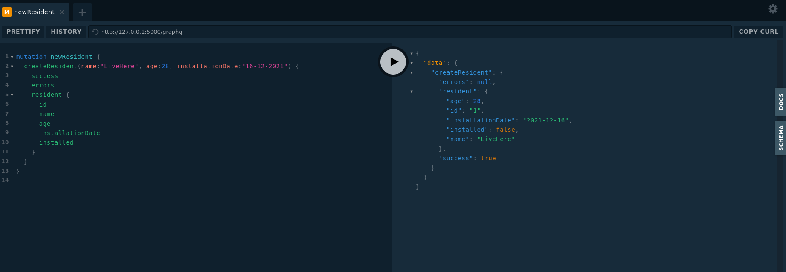
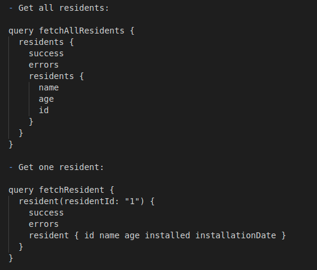
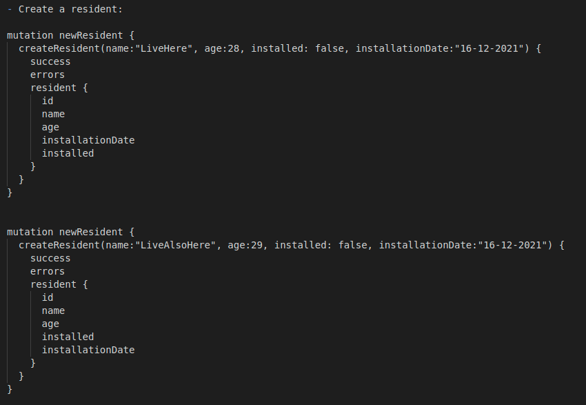
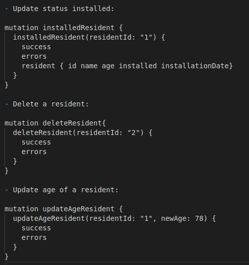

# simple-graphql-python

### installation

- python -m venv simple-graphql-python-env

- pip install flask ariadne flask-sqlalchemy

- export FLASK_APP=main.py

- flask run

check http://127.0.0.1:5000

### playground

url : 127.0.0.1:5000/graphql

### queries

